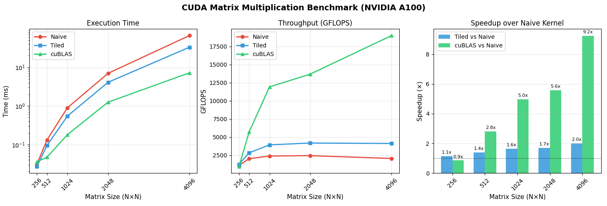

# CUDA Matrix Multiplication: Naive vs Tiled Shared Memory vs cuBLAS

## Overview

This project investigates the impact of memory hierarchy optimizations on GPU matrix multiplication (GEMM) using CUDA.

Three implementations are compared:

1. **Naive CUDA Kernel** – each thread computes a single output element directly from global memory.
2. **Tiled Shared-Memory Kernel** – uses 32×32 shared-memory tiles to reduce global memory traffic and increase data reuse.
3. **cuBLAS** – NVIDIA's highly optimized BLAS library used as a state-of-the-art baseline.

The experiments were executed on an **NVIDIA A100-SXM4-40GB GPU** using the **Mahti Supercomputer (CSC, Finland)**.

## Objectives

The main goals of the project are:

* Implement a correct naive CUDA matrix multiplication kernel.
* Optimize the implementation using shared-memory tiling.
* Benchmark both implementations against NVIDIA cuBLAS.
* Analyze the performance benefits of memory reuse.
* Evaluate scalability for matrices ranging from 256×256 to 4096×4096.

## Results Summary

### Execution Time (ms)

| N    | Naive | Tiled | cuBLAS |
| ---- | ----- | ----- | ------ |
| 256  | 0.03  | 0.03  | 0.04   |
| 512  | 0.13  | 0.09  | 0.05   |
| 1024 | 0.90  | 0.55  | 0.18   |
| 2048 | 7.02  | 4.11  | 1.26   |
| 4096 | 66.84 | 33.35 | 7.24   |

### Throughput (GFLOPS)

| N    | Naive | Tiled | cuBLAS |
| ---- | ----- | ----- | ------ |
| 256  | 1092  | 1253  | 936    |
| 512  | 2032  | 2828  | 5699   |
| 1024 | 2397  | 3935  | 11916  |
| 2048 | 2449  | 4182  | 13673  |
| 4096 | 2056  | 4122  | 18992  |

### Speedup over Naive

| N    | Tiled / Naive | cuBLAS / Naive |
| ---- | ------------- | -------------- |
| 256  | 1.15×         | 0.75×          |
| 512  | 1.39×         | 2.60×          |
| 1024 | 1.64×         | 5.00×          |
| 2048 | 1.71×         | 5.57×          |
| 4096 | 2.00×         | 9.23×          |

### Main Findings

* Shared-memory tiling consistently improves performance over the naive kernel.
* The tiled implementation achieves up to **2.0× speedup**.
* cuBLAS reaches nearly **19 TFLOPS**, corresponding to approximately **97% of the theoretical FP32 peak performance** of the NVIDIA A100.
* Memory access optimization is essential for high GPU utilization.

## Benchmark Visualization



## Project Structure

```text
.
├── src/
│   ├── benchmark.cu
│   ├── matmul_naive.cu
│   ├── matmul_tiled.cu
│   └── matmul_cublas.cu
│
├── scripts/
│   └── run_mahti.sh
│
├── results/
│   ├── benchmark.csv
│   └── benchmark_plots.png
│
├── logs/
│   ├── matmul_*.out
│   └── matmul_*.err
│
├── report/
│   ├── CUDA_Matrix_Multiplication.pdf
│   └── CUDA_Matrix_Multiplication.docx
│
├── Makefile
├── requirements.txt
└── README.md
```

## Experimental Platform

| Component          | Specification         |
| ------------------ | --------------------- |
| GPU                | NVIDIA A100-SXM4-40GB |
| Compute Capability | 8.0                   |
| GPU Memory         | 40 GB HBM2e           |
| CPU                | AMD EPYC 7H12         |
| CUDA Version       | 11.5                  |
| Data Type          | FP32                  |
| Tile Size          | 32 × 32               |
| Block Size         | 16 × 16               |

## Running on Mahti (CSC)

### Clone the repository

```bash
git clone https://github.com/ChemaCrema/Parallel_Programming_finalproject.git
cd Parallel_Programming_finalproject
```

### Configure the project ID

Edit:

```bash
scripts/run_mahti.sh
```

and replace:

```bash
YOUR_PROJECT_ID
```

with your CSC project account.

### Submit the job

```bash
mkdir -p logs
sbatch scripts/run_mahti.sh
```

### Monitor execution

```bash
squeue -u $USER
```

After completion:

```bash
cat logs/matmul_<jobid>.out
```

## Running Locally

### Compile

```bash
make
```

### Run benchmark

```bash
./benchmark
```

### Generate plots

```bash
python3 results/plot.py
```

## Requirements

* CUDA 11.x or newer
* cuBLAS
* NVIDIA GPU
* Python 3
* pandas
* matplotlib

Install Python dependencies:

```bash
pip install -r requirements.txt
```

## References

1. NVIDIA CUDA C++ Programming Guide
2. NVIDIA cuBLAS Documentation
3. Volkov, V. Better Performance at Lower Occupancy (GTC 2010)
4. NVIDIA CUTLASS Library
5. CSC Mahti Supercomputer Documentation

```
```
